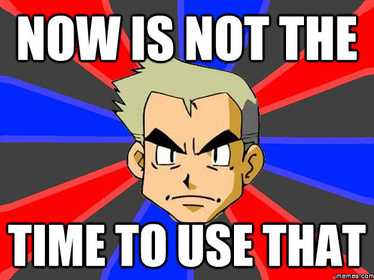

# ItemBlacklist

Mod does not require D3Core.



## Commands
### `/blockitem` (also `/itemblacklist` or `/blacklist`)
The main command, it has an ingame help. (`/blockitem help`)

### `/unpack`
Lets anyone unpack there own inventory. Useful for items required in crafting. **Can be disabled in the config**

## Pack vs World bans

Since v1.2 there is 2 possible blacklists:

**They both apply at the same time!**

- World:
    Changeable trough the command `/blockitem`. Also a file: `<world data>/ItemBlacklist.json`.
- Pack:
    Only via the file: `config/ItemBlacklist.json`.

You cannot change the pack config in the game, its meant for pack makers who want to ban items from use for all servers.
If you as a server owner then want to ban more items, just use the command.

This also makes it easy to maintain the 2 lists. The pack maker can update the Pack list, and not override bans made by server owners.
And server owners can further restrict items without much effort. The only hard thing comes when a server owner wants to overrule a pack maker's ban.
You will have to manually edit the Pack JSON file (`config/ItemBlacklist.json`) to remove the entry, and do that every pack update.

For this reason I recommend pack makers to provide an extra file, if they want to have optional/recommended extra bans, 
and put that file somewhere safe (so it won't override `world/ItemBlacklist.json`!), and attach a note to your server download/info page.

## JSON format

Example format: 
```javascript
{
  "__GLOBAL__": [
    {
      "item": "minecraft:wool",
      "damage": "1"
    }
  ],
  "0": [
    {
      "item": "minecraft:wool",
      "damage": "*"
    }
  ]
}
```

This file means that:
Wool with damage 1 (orange wool) is banned everywhere.
Wool with any damage (any color) is banned in the overworld (dim 0)

### Ranges / Multiple dimensions

If you want to specify multiple dimensions (for example, "0, -1 and 1", you can do so by using a comma `,` to separate the numbers: `0,-1,1`.
You can also specify a range of dimensions with the pound/hash `#` symbol: `10#100`.

You can create multiple overlapping ranges, they should merge. Just don't make 2 identical ranges.
 